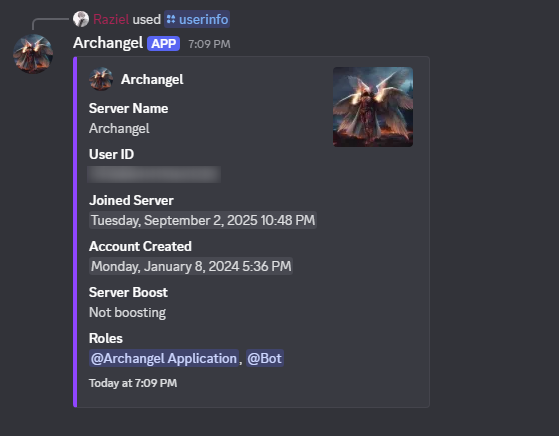

# Archangel-DiscordBot ⚔️

Archangel is a **powerful multipurpose Discord bot** built with [discord.js](https://discord.js.org).  
It’s designed for **moderation, utility, and interactive fun**, with a clean modular structure for easy expansion.  

---

## ✨ Features

- **Moderation Tools**  
  - `kickuser`   — Kick a user from the server
  - `ban`        — Ban a user from the server
  - `warn`       — Warn a user and log the reason
  - `clearwarn`  — Clear all warnings for a user
  - `warnings`   — List warnings for a user (with pagination)
  - `unban`      — Unban a user by ID
  - `mute`       — Temporarily mute (timeout) a user for a set duration
  - `unmute`     — Remove a mute (timeout) from a user
  - `purge`      — Delete a set number of recent messages
  - `lock`       — Lock the current channel (prevent sending messages)
  - `unlock`     — Unlock the current channel (allow sending messages) 

- **Utility Commands**  
  - `afk` — Set an AFK status  
  - `avatar` — Fetch a user’s profile picture
  - `echo` — Make the bot repeat your message 
  - `ping` — Check latency
  - `serverinfo` — Display server stats
  - `stats` — Show bot statistics 
  - `timer` — Set timers
  - `translate` — Translate text
  - `userinfo` — Display detailed info on a user
  - `welcome`  — Sets the welcome message for a server 

- **User Interactive Commands**  
  - `hug`        — Hug another user
  - `kill`       — Playfully kill another user
  - `slap`       — Slap another user
  - `pat`        — Pat another user
  - `cuddle`     — Cuddle another user
  - `kiss`       — Kiss another user
  - `lick`       — Lick another user
  - `bite`       — Bite another user
  - `punch`      — Punch another user
  - `kick`       — Kick another user
  - `stare`      — Stare at another user
  - `wave`       — Wave at another user
  - `highfive`   — High five another user
  - `handhold`   — Hold hands with another user
  - `poke`       — Poke another user
  - `tickle`     — Tickle another user
  - `dance`      — Dance with another user
  - `blush`      — Blush at another user
  - `cry`        — Cry to another user
  - `laugh`      — Laugh at another user
  - `shrug`      — Shrug at another user
  

- **Embed Builder Utilities**  
  Prebuilt helpers for clean, consistent Discord embeds.  

- **Command & Event Handlers**  
  Automatic registration of commands and events through `functions/handlers`.  

---

## 📷 Bot Images

    

## 📂 Project Structure

```bash
src
├── Bot.js              
├── config.json          
├── deployCommands.js    
├── commands
│   ├── administrative
│   │   └── moderationRegistry.js
│   ├── userInteractive
│   │   └── actionRegistry.js
│   └── utility
│       ├── afk.js
│       ├── avatar.js
│       ├── echo.js
│       ├── ping.js
│       ├── serverinfo.js
│       ├── stats.js
│       ├── timer.js
│       ├── translate.js
│       └── userinfo.js
├── events
│   ├── interactionCreate.js
│   └── ready.js
├── functions
│   └── handlers
│       ├── handleCommands.js
│       └── handleEvents.js
└── utils
    ├── actionCommands.js
    ├── buildEmbed.js
    ├── fetchReq.js
    ├── moderationCommands.js
    └── logs
        └── warnings.json
```        

---

## ⚙️ Setup & Installation

1. Clone repository:
```bash 
git clone https://github.com/Raziel206/Archangel-DiscordBot.git
cd Archangel-DiscordBot
```
2. Install dependencies: 
```bash
npm init
npm install node
npm install openai
npm install @google/genai
npm install discord.js
npm install dotenv
```
3. Configure environment:
Create a configs.json file inside src
```bash
{
   "token": "YOUR_DISCORD_BOT_TOKEN",
   "clientId": "YOUR_CLIENT_ID",
   "tenor_apikey": "YOUR_TENOR_APIKEY",
   "gemini_apikey": "YOUR_GEMINIAPIKEY"
}
```
4. Register slash commands:
```bash
node src/deployCommands.js
```
5. Run the bot:
```bash
node src/Bot.js
```

---

## 🤝 Contributing

### Contributions are welcome!

1. Fork the repo.

2. Create a new branch: `git checkout -b feature/my-feature`

3. Commit changes and push.

4. Open a Pull Request.

---

## 📜 License

This project is licensed under the **MIT License** — see [LICENSE](https://opensource.org/license/mit) for details.

---

## 🙌 Credits

Developed with ❤️ by Raziel206.
Thanks to the [discord.js](https://discord.js.org), [google gemini](https://ai.google.dev) and [tenor](https://tenor.com/gifapi/documentation#quickstart) communities for their excellent libraries. 